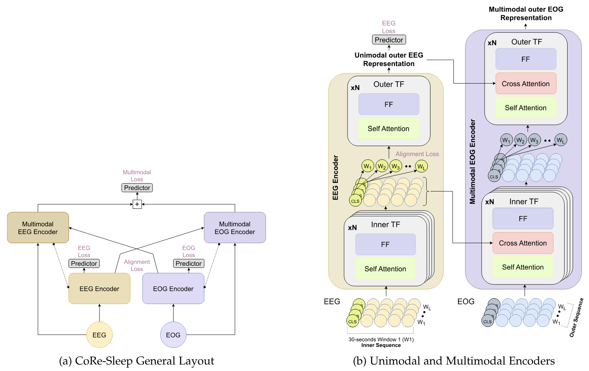

# CoRe-Sleep: A Multimodal Fusion Framework for Time Series Robust to Imperfect Modalities

Konstantinos Kontras, Christos Chatzichristos, Huy Phan, Johan Suykens, and Maarten De Vos  
*IEEE Transactions on Neural Systems and Rehabilitation Engineering, 2024*  

This repository contains the official implementation of the paper: [ArXiv](https://arxiv.org/abs/2304.06485), [IEEE TNSR](https://ieeexplore.ieee.org/stamp/stamp.jsp?arnumber=10400520)

---

## 🚀 Overview 
CoRe-Sleep is a multimodal deep learning framework for automated **sleep staging**.  
Unlike previous approaches that rely solely on EEG, CoRe-Sleep leverages **EEG + EOG** with a coordinated representation fusion strategy.  

Key features:
- **Robustness to missing modalities** (EEG or EOG absent)  
- **Robustness to noisy modalities**  
- **Training with incomplete multimodal data**  
- **State-of-the-art performance** on the SHHS-1 dataset  



---


## 📂 Repository Structure

```text
CoRe-Sleep/
│── agents/             
│   └── helpers/        # Evaluator, Loader, Trainer, Validator 
│── configs/            # Configuration files for each experiment + default config
│── datasets/           # Dataset loaders (SHHS-1)
│── experiments/        # Preprocessed trial data
│── figs/               # Figures & sample outputs
│── models/             # Model architectures (EEG/EOG encoders, fusion)
│── posthoc/            # Post-hoc Testing & Evaluation scripts
│── utils/              # Utility scripts
│── run.sh              # Shell script to launch training/testing (full or noisy)
│── train.py            # Training entry point
│── requirements.txt    # Dependencies
└── README.md           # You are here
```

## 🔍 Evaluation & Post-hoc
```bash
python post_show.py --config ./configs/CoRe.json    --default_config ./configs/default_config.json --fold 0 --al 0.1 --ms 1
python post_test.py --config ./configs/CoRe.json    --default_config ./configs/default_config.json --fold 0 --al 0.1 --ms 1
python post_linearprob.py --config ./configs/CoRe.json    --default_config ./configs/default_config.json --fold 0 --al 0.1 --ms 1
```

## 🏋️ Training

```bash
python train.py --config ./configs/CoRe.json    --default_config ./configs/default_config.json --fold 0 --al 0.1 --ms 1
```

## 📊 Dataset

We use the **Sleep Heart Health Study (SHHS-1)** dataset for all experiments.

### 1. Access
- Request access via the [National Sleep Research Resource (NSRR)](https://sleepdata.org/datasets/shhs).  
- Download the **SHHS-1** recordings and annotation files.

### 2. Modalities Used
- **EEG (C4-A1)** — sampled originally at 125 Hz  
- **EOG (L-R)** — sampled originally at 50 Hz  

### 3. Preprocessing
Following the pipeline described in the paper:
- Resample both EEG and EOG to **100 Hz**  
- Apply **bandpass filtering**:  
  - EEG: 0.3–40 Hz  
  - EOG: 0.3–23 Hz  
- Apply **Short-Time Fourier Transform (STFT)**:  
  - 2-second windows  
  - 1-second overlap  
  - 256-point Hamming window  
- Construct **30-second epochs** (aligned with AASM sleep stage labels)  
- Labels are merged as: **{Wake, N1, N2, N3, REM}** (N3 = N3 + N4)

### 4. Implementation
Preprocessing and dataset handling were implemented using SleepTransformer paper. 


##  Citation

If you use this code or models in your work, please cite:

```markdown
@article{kontras2024coresleep,
  title={CoRe-Sleep: A Multimodal Fusion Framework for Time Series Robust to Imperfect Modalities},
  author={Kontras, Konstantinos and Chatzichristos, Christos and Phan, Huy and Suykens, Johan and De Vos, Maarten},
  journal={IEEE Transactions on Neural Systems and Rehabilitation Engineering},
  volume={32},
  year={2024},
  publisher={IEEE}
}
```